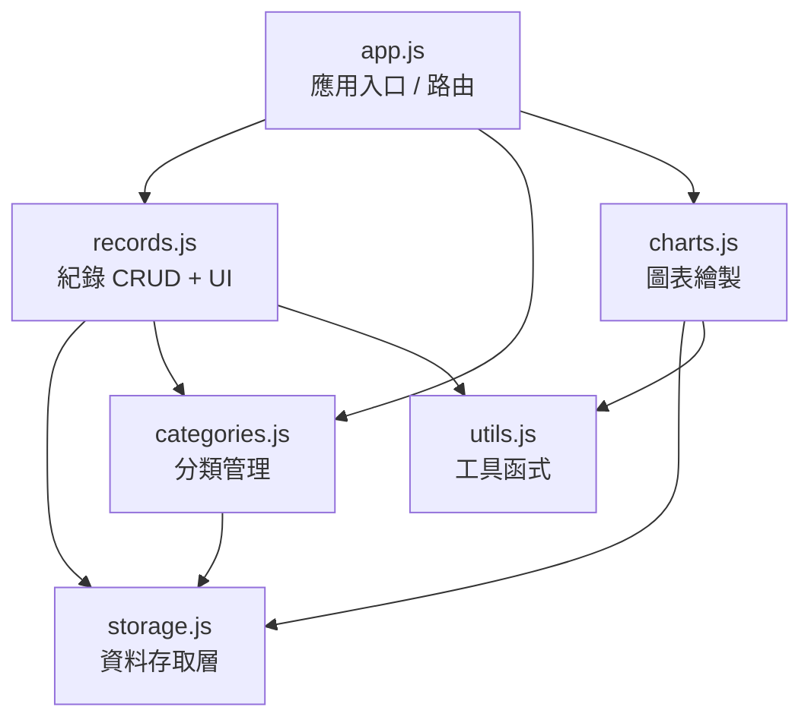
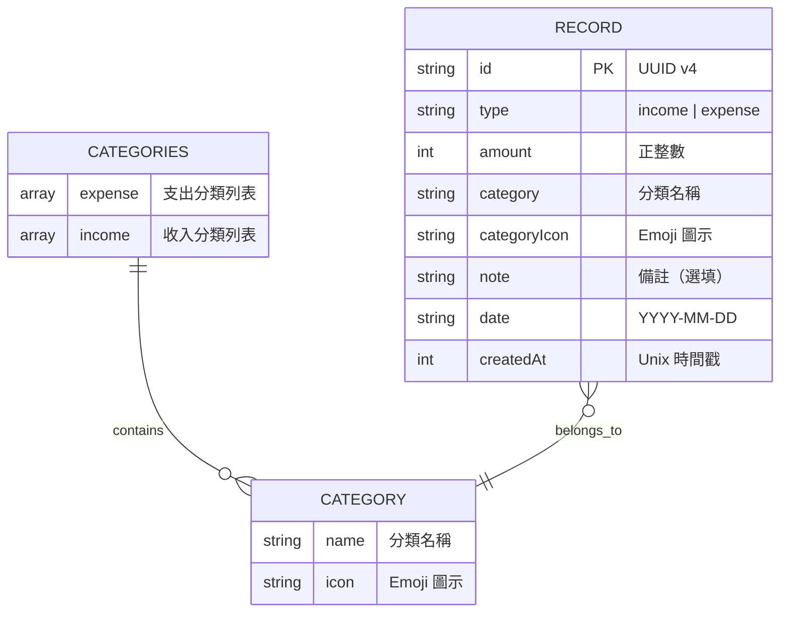
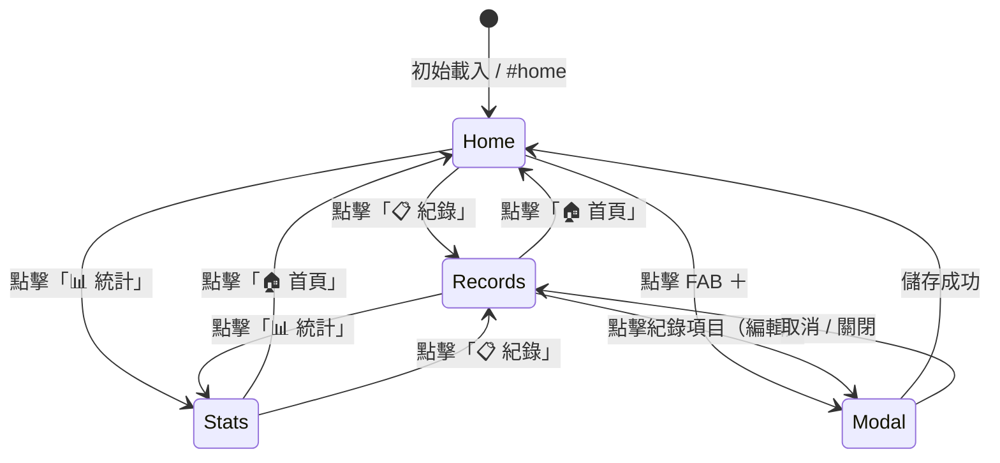
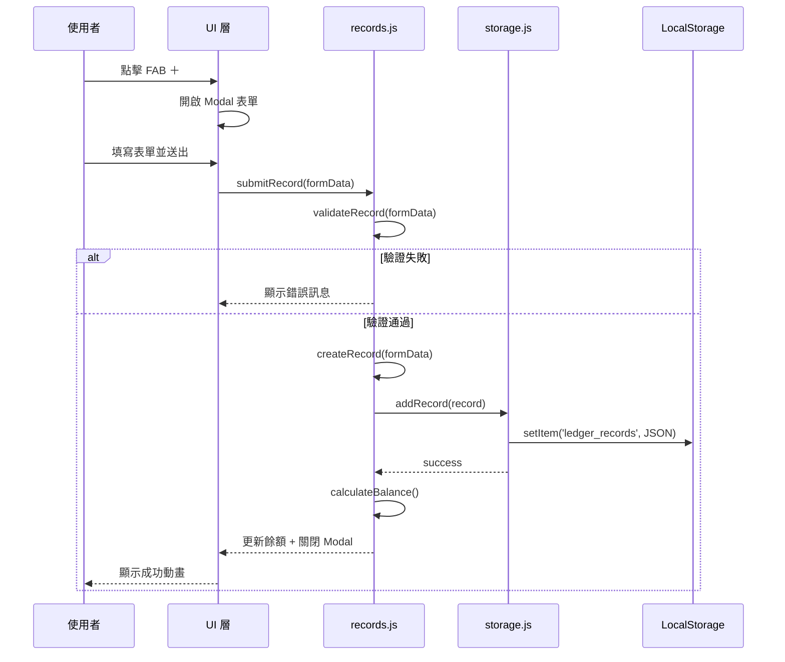
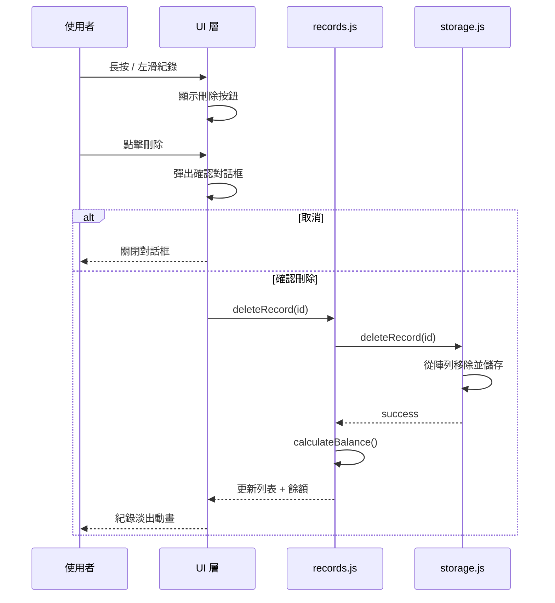

# 個人記帳簿系統 — 架構設計文件

## 1. 系統總覽

個人記帳簿是一個**純前端單頁應用（SPA）**，使用瀏覽器 LocalStorage 作為持久化儲存，無需後端伺服器。系統採用模組化 JavaScript 架構，以關注點分離（Separation of Concerns）為核心設計原則。

### 1.1 架構風格

```
┌─────────────────────────────────────────────┐
│                  使用者介面                   │
│            （HTML + CSS + Events）            │
├─────────────────────────────────────────────┤
│                  應用層                       │
│         （路由管理 / 頁面控制器）              │
├──────────┬──────────┬──────────┬─────────────┤
│  紀錄模組 │  分類模組 │  圖表模組 │  匯出模組   │
│ records  │categories│  charts  │   export    │
├──────────┴──────────┴──────────┴─────────────┤
│                  資料存取層                    │
│              （storage.js）                   │
├─────────────────────────────────────────────┤
│              LocalStorage                    │
└─────────────────────────────────────────────┘
```

### 1.2 設計原則

| 原則 | 說明 |
|------|------|
| **模組化** | 每個功能獨立一個 JS 模組，職責單一 |
| **關注點分離** | UI 渲染、業務邏輯、資料存取三層分離 |
| **零依賴** | 不使用任何第三方函式庫 |
| **漸進增強** | 核心功能優先，統計圖表等進階功能分階段實作 |
| **行動優先** | 以手機螢幕為基礎設計，向上適配桌面 |

---

## 2. 檔案結構

```
melody6968806-hue/
├── index.html              # SPA 主頁面，所有頁面視圖容器
├── css/
│   └── style.css           # 完整樣式表（CSS Variables 設計系統）
├── js/
│   ├── app.js              # 應用入口、路由管理、全域事件
│   ├── storage.js          # LocalStorage 資料存取層（DAL）
│   ├── records.js          # 收支紀錄 CRUD 邏輯 + UI 渲染
│   ├── categories.js       # 分類資料定義與管理
│   ├── charts.js           # Canvas 統計圖表繪製（P1）
│   └── utils.js            # 通用工具函式
├── PRD.md                  # 產品需求文件
├── ARCHITECTURE.md         # 架構設計文件（本文件）
└── README.md               # 專案說明
```

---

## 3. 模組設計

### 3.1 模組依賴關係



> 所有模組透過 ES6 Module（`import` / `export`）進行載入，`app.js` 為唯一入口。

---

### 3.2 各模組職責

#### `app.js` — 應用入口 & 路由管理

| 職責 | 說明 |
|------|------|
| **初始化** | DOMContentLoaded 後初始化各模組 |
| **路由管理** | 管理三個主頁面（首頁 / 紀錄 / 統計）的切換 |
| **全域事件** | 底部導航列點擊、FAB 浮動按鈕 |
| **Modal 控制** | 新增 / 編輯紀錄的 Modal 開關 |

```javascript
// 路由策略：Hash-based SPA Router
// 頁面對應：
//   #home     → 首頁儀表板
//   #records  → 歷史紀錄清單
//   #stats    → 月度統計圖表

export function initApp() {
  initStorage();          // 初始化資料層
  initCategories();       // 載入分類資料
  bindNavigation();       // 綁定底部導航
  bindFAB();              // 綁定新增按鈕
  handleRoute();          // 處理當前路由
  window.addEventListener('hashchange', handleRoute);
}
```

---

#### `storage.js` — 資料存取層（DAL）

這是整個應用唯一與 LocalStorage 互動的模組，提供統一的 CRUD 介面。

| 方法 | 說明 |
|------|------|
| `getRecords()` | 取得所有紀錄陣列 |
| `getRecordById(id)` | 依 ID 取得單筆紀錄 |
| `addRecord(record)` | 新增一筆紀錄 |
| `updateRecord(id, data)` | 更新指定紀錄 |
| `deleteRecord(id)` | 刪除指定紀錄 |
| `getCategories()` | 取得分類設定 |
| `saveCategories(cats)` | 儲存分類設定 |
| `exportToCSV(filters)` | 匯出篩選後的 CSV |

```javascript
// LocalStorage Key 常數
const STORAGE_KEYS = {
  RECORDS: 'ledger_records',
  CATEGORIES: 'ledger_categories',
  SETTINGS: 'ledger_settings'
};

// 資料讀取（含錯誤處理）
export function getRecords() {
  try {
    const raw = localStorage.getItem(STORAGE_KEYS.RECORDS);
    return raw ? JSON.parse(raw) : [];
  } catch (e) {
    console.error('資料讀取失敗:', e);
    return [];
  }
}

// 資料寫入（含容量檢查）
export function saveRecords(records) {
  try {
    const json = JSON.stringify(records);
    localStorage.setItem(STORAGE_KEYS.RECORDS, json);
    return true;
  } catch (e) {
    if (e.name === 'QuotaExceededError') {
      alert('儲存空間已滿，請匯出備份後清理舊紀錄。');
    }
    return false;
  }
}
```

---

#### `records.js` — 收支紀錄模組

| 職責 | 說明 |
|------|------|
| **CRUD 邏輯** | 新增、讀取、更新、刪除紀錄 |
| **表單管理** | 新增 / 編輯 Modal 的表單驗證與提交 |
| **列表渲染** | 歷史紀錄清單的 DOM 渲染 |
| **篩選搜尋** | 按月份、分類、關鍵字篩選 |
| **餘額計算** | 即時計算並更新首頁餘額 |

```javascript
// 紀錄資料模型
function createRecord({ type, amount, category, categoryIcon, note, date }) {
  return {
    id: generateUUID(),
    type,                    // 'income' | 'expense'
    amount: Math.abs(amount),
    category,
    categoryIcon,
    note: note || '',
    date,                    // 'YYYY-MM-DD'
    createdAt: Date.now()
  };
}

// 餘額計算
export function calculateBalance(records) {
  return records.reduce((balance, record) => {
    return record.type === 'income'
      ? balance + record.amount
      : balance - record.amount;
  }, 0);
}

// 月度摘要
export function getMonthSummary(records, year, month) {
  const filtered = records.filter(r => {
    const d = new Date(r.date);
    return d.getFullYear() === year && d.getMonth() === month;
  });

  return {
    income: filtered.filter(r => r.type === 'income')
                     .reduce((sum, r) => sum + r.amount, 0),
    expense: filtered.filter(r => r.type === 'expense')
                      .reduce((sum, r) => sum + r.amount, 0),
    records: filtered
  };
}
```

---

#### `categories.js` — 分類管理模組

```javascript
// 預設分類定義
export const DEFAULT_CATEGORIES = {
  expense: [
    { name: '餐飲',     icon: '🍜' },
    { name: '購物',     icon: '🛒' },
    { name: '日常規費', icon: '🏠' },
    { name: '交通',     icon: '🚗' },
    { name: '醫療',     icon: '🏥' },
    { name: '教育',     icon: '🎓' },
    { name: '娛樂',     icon: '🎉' },
    { name: '其他',     icon: '📦' }
  ],
  income: [
    { name: '薪資', icon: '💰' },
    { name: '獎金', icon: '🎁' },
    { name: '兼職', icon: '💵' },
    { name: '投資', icon: '📈' },
    { name: '其他', icon: '📦' }
  ]
};

// 初始化：若 LocalStorage 無分類資料則寫入預設值
export function initCategories() {
  const existing = getCategories();
  if (!existing) {
    saveCategories(DEFAULT_CATEGORIES);
  }
}
```

---

#### `charts.js` — 圖表模組（P1）

| 圖表 | 技術 | 用途 |
|------|------|------|
| **圓餅圖** | Canvas 2D API | 各分類支出佔比 |
| **長條圖** | Canvas 2D API | 近 6 個月收支趨勢 |

```javascript
// 圓餅圖繪製（概要）
export function renderPieChart(canvasId, categoryData) {
  const canvas = document.getElementById(canvasId);
  const ctx = canvas.getContext('2d');
  const total = categoryData.reduce((sum, c) => sum + c.amount, 0);

  let startAngle = -Math.PI / 2;
  categoryData.forEach(({ category, amount, color }) => {
    const sliceAngle = (amount / total) * 2 * Math.PI;
    ctx.beginPath();
    ctx.moveTo(centerX, centerY);
    ctx.arc(centerX, centerY, radius, startAngle, startAngle + sliceAngle);
    ctx.fillStyle = color;
    ctx.fill();
    startAngle += sliceAngle;
  });
}
```

---

#### `utils.js` — 工具函式

```javascript
// UUID 生成（v4 簡易版）
export function generateUUID() {
  return 'xxxxxxxx-xxxx-4xxx-yxxx-xxxxxxxxxxxx'.replace(/[xy]/g, c => {
    const r = Math.random() * 16 | 0;
    return (c === 'x' ? r : (r & 0x3 | 0x8)).toString(16);
  });
}

// 金額格式化（千分位 + NT$）
export function formatCurrency(amount) {
  const prefix = amount >= 0 ? '+' : '';
  return `${prefix}NT$ ${Math.abs(amount).toLocaleString('zh-TW')}`;
}

// 日期格式化
export function formatDate(dateStr) {
  const d = new Date(dateStr);
  const weekdays = ['日', '一', '二', '三', '四', '五', '六'];
  return `${d.getFullYear()} 年 ${d.getMonth() + 1} 月 ${d.getDate()} 日（${weekdays[d.getDay()]}）`;
}

// 表單驗證
export function validateRecord({ amount, category, date }) {
  const errors = [];
  if (!amount || amount <= 0) errors.push('請輸入有效金額');
  if (!category) errors.push('請選擇分類');
  if (!date) errors.push('請選擇日期');
  return { valid: errors.length === 0, errors };
}
```

---

## 4. 資料架構

### 4.1 LocalStorage Schema

系統使用三個 key 儲存資料：

| Key | 型別 | 說明 |
|-----|------|------|
| `ledger_records` | `Record[]` | 所有收支紀錄 |
| `ledger_categories` | `Categories` | 分類設定 |
| `ledger_settings` | `Settings` | 使用者偏好設定 |

### 4.2 資料模型



### 4.3 儲存容量估算

| 項目 | 估算 |
|------|------|
| 單筆紀錄大小 | ~200 bytes（JSON） |
| LocalStorage 上限 | ~5 MB |
| 可儲存紀錄筆數 | ~25,000 筆 |
| 每月平均紀錄 | ~60 筆（每天 2 筆） |
| 可使用年限 | ~34 年（理論值） |

---

## 5. UI 架構

### 5.1 頁面結構（SPA）

```html
<body>
  <!-- 頂部標題列 -->
  <header id="app-header">...</header>

  <!-- 三個頁面視圖容器（同時只顯示一個） -->
  <main id="app-main">
    <section id="page-home" class="page active">...</section>
    <section id="page-records" class="page">...</section>
    <section id="page-stats" class="page">...</section>
  </main>

  <!-- FAB 浮動新增按鈕 -->
  <button id="fab-add" class="fab">＋</button>

  <!-- 底部導航列 -->
  <nav id="app-nav">
    <button data-page="home">🏠 首頁</button>
    <button data-page="records">📋 紀錄</button>
    <button data-page="stats">📊 統計</button>
  </nav>

  <!-- Modal 覆蓋層（新增 / 編輯紀錄） -->
  <div id="modal-overlay" class="modal-overlay hidden">
    <div id="record-modal" class="modal">...</div>
  </div>

  <!-- 刪除確認對話框 -->
  <div id="confirm-dialog" class="dialog hidden">...</div>
</body>
```

### 5.2 頁面切換機制



### 5.3 響應式斷點

| 斷點 | 寬度 | 佈局調整 |
|------|------|----------|
| **Mobile** | < 480px | 單欄、全寬卡片、底部導航 |
| **Tablet** | 480–768px | 雙欄摘要卡片、底部導航 |
| **Desktop** | > 768px | 側邊導航、三欄佈局 |

```css
/* 響應式斷點 */
@media (min-width: 480px)  { /* Tablet 適配 */ }
@media (min-width: 768px)  { /* Desktop 適配 */ }
```

---

## 6. 事件流與資料流

### 6.1 新增紀錄流程



### 6.2 刪除紀錄流程



---

## 7. CSS 設計系統

### 7.1 Design Tokens

```css
:root {
  /* === 色彩 === */
  --primary: #4ECDC4;
  --primary-dark: #3AB5AD;
  --primary-light: #A8E6CF;
  --income: #6BCB77;
  --expense: #FF6B6B;
  --bg: #FFF8F0;
  --card: #FFFFFF;
  --text-primary: #2D3436;
  --text-secondary: #636E72;
  --border: #E8E8E8;
  --accent: #FF8A5C;

  /* === 間距 === */
  --space-xs: 4px;
  --space-sm: 8px;
  --space-md: 16px;
  --space-lg: 24px;
  --space-xl: 32px;

  /* === 圓角 === */
  --radius-sm: 8px;
  --radius-md: 12px;
  --radius-lg: 16px;
  --radius-full: 50%;

  /* === 陰影 === */
  --shadow-sm: 0 2px 8px rgba(0, 0, 0, 0.06);
  --shadow-md: 0 4px 16px rgba(0, 0, 0, 0.1);
  --shadow-lg: 0 8px 32px rgba(0, 0, 0, 0.12);

  /* === 字體 === */
  --font-family: 'Noto Sans TC', sans-serif;
  --font-size-xs: 12px;
  --font-size-sm: 14px;
  --font-size-md: 16px;
  --font-size-lg: 20px;
  --font-size-xl: 28px;
  --font-size-2xl: 36px;

  /* === 動畫 === */
  --transition-fast: 150ms ease;
  --transition-normal: 250ms ease;
  --transition-slow: 400ms ease;
}
```

### 7.2 元件樣式清單

| 元件 | Class 名稱 | 說明 |
|------|-----------|------|
| 卡片 | `.card` | 白色圓角卡片 + 陰影 |
| 餘額顯示 | `.balance-display` | 大字餘額（含正負色） |
| 摘要卡片 | `.summary-card` | 收入 / 支出摘要 |
| 紀錄項目 | `.record-item` | 單筆紀錄列表項 |
| 日期分組 | `.date-group` | 日期標題 + 日計 |
| 導航列 | `.nav-bar` | 底部三選項導航 |
| FAB 按鈕 | `.fab` | 右下角浮動按鈕 |
| Modal | `.modal` | 新增 / 編輯彈窗 |
| 表單元件 | `.form-*` | 輸入框、選單、按鈕 |
| 對話框 | `.dialog` | 確認刪除對話框 |
| 篩選列 | `.filter-bar` | 月份 / 分類篩選 |

---

## 8. 效能策略

| 策略 | 實作方式 |
|------|----------|
| **懶渲染** | 歷史紀錄分批渲染（每次 20 筆），滾動時載入更多 |
| **事件委派** | 紀錄列表使用事件委派（event delegation），避免大量監聽器 |
| **防抖搜尋** | 搜尋輸入使用 debounce（300ms），減少不必要的計算 |
| **最小 DOM** | 切換頁面時只顯示/隱藏，不重建 DOM |
| **快取計算** | 餘額與月度摘要在資料變更時計算一次並快取 |

---

## 9. 錯誤處理

| 場景 | 處理方式 |
|------|----------|
| LocalStorage 無法存取 | 顯示警告提示，功能降級為記憶體暫存 |
| 儲存空間已滿 | 彈出提示，引導匯出並清理舊紀錄 |
| JSON 解析失敗 | 回傳空陣列，不影響操作，記錄錯誤至 console |
| 表單驗證失敗 | 即時顯示欄位錯誤訊息，不送出 |
| 無紀錄（空狀態） | 顯示友善的空狀態插圖與引導文字 |

---

## 10. 未來擴展考量

| 方向 | 說明 | 影響範圍 |
|------|------|----------|
| **IndexedDB 遷移** | 突破 5MB 限制，支援更大量資料 | storage.js 重寫 |
| **PWA 支援** | 加入 Service Worker + manifest | 新增檔案 |
| **雲端同步** | 整合 Firebase 或 Supabase | storage.js 改為 API 呼叫 |
| **多帳戶** | 現金 / 銀行 / 信用卡 | 資料模型擴充 |
| **預算管理** | 每月預設預算 + 超支提醒 | 新增模組 |
| **深色模式** | CSS Variables 切換 | style.css 擴充 |

> 架構設計已預留擴展彈性：`storage.js` 作為資料存取抽象層，未來可整層替換而不影響上層業務邏輯。
