# 個人記帳簿系統 — 流程圖文件

> 本文件根據 [PRD.md](file:///c:/Users/MB07/111/melody6968806-hue/PRD.md) 與 [ARCHITECTURE.md](file:///c:/Users/MB07/111/melody6968806-hue/ARCHITECTURE.md) 產出，涵蓋系統主要用戶流程與技術流程。

---

## 1. 系統總覽流程

### 1.1 應用啟動流程

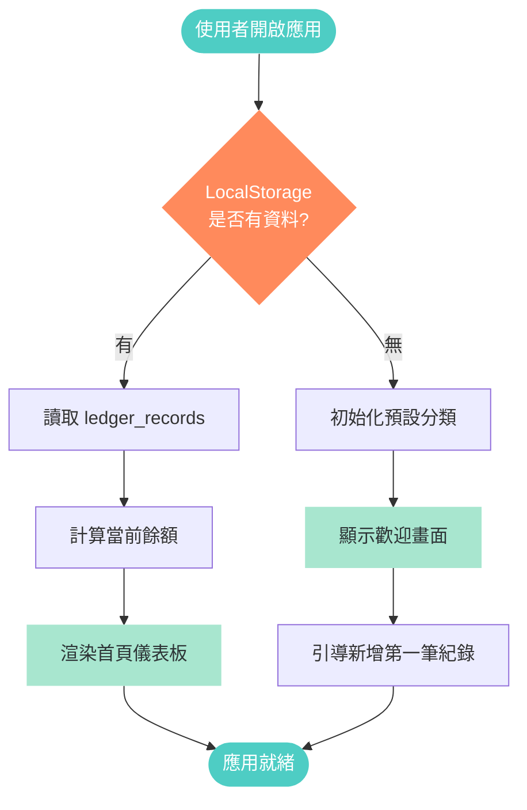

---

### 1.2 頁面導航流程

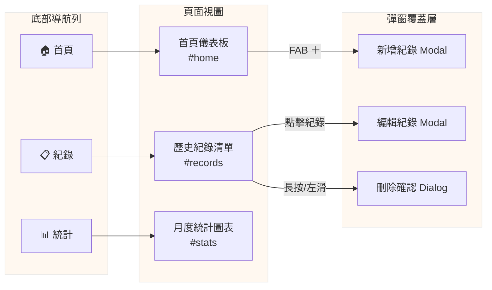

---

## 2. 核心用戶流程

### 2.1 新增收支紀錄

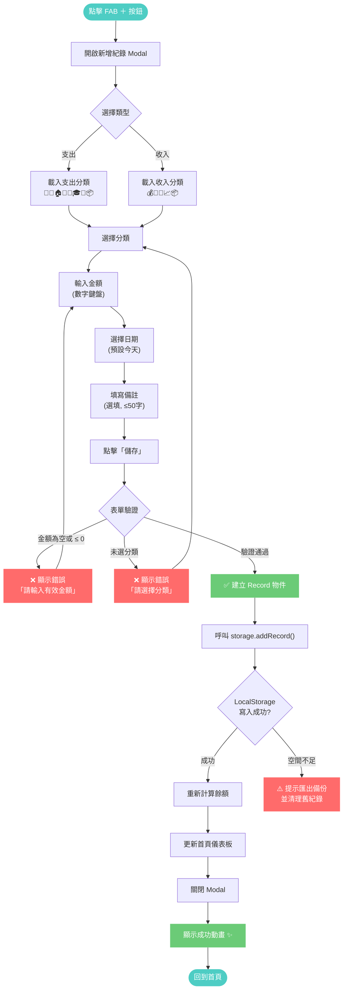

---

### 2.2 編輯紀錄

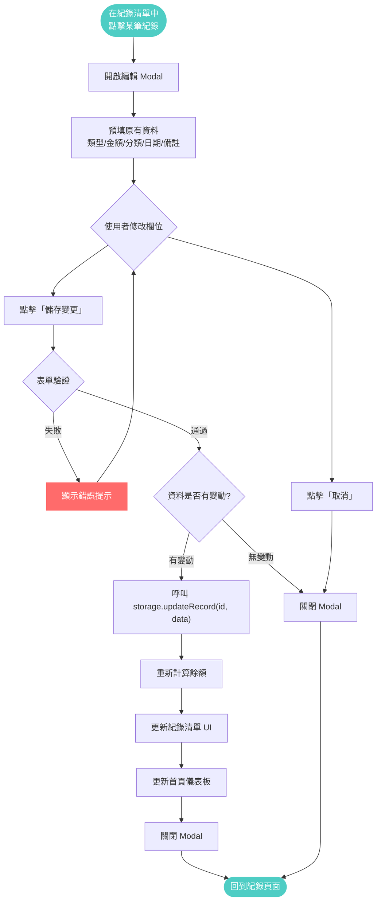

---

### 2.3 刪除紀錄

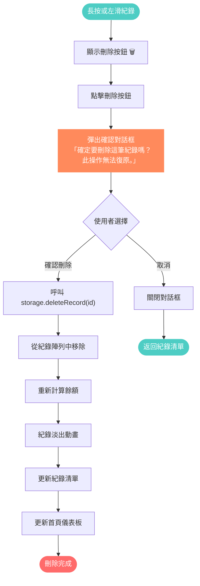

---

### 2.4 查看歷史紀錄

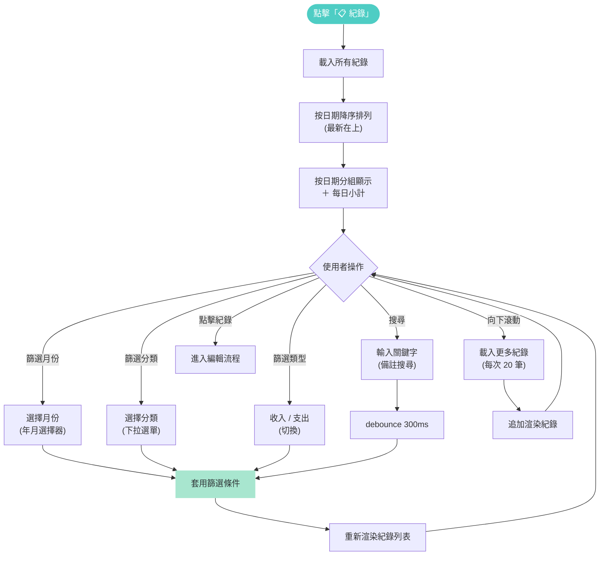

---

## 3. 資料處理流程

### 3.1 餘額計算流程

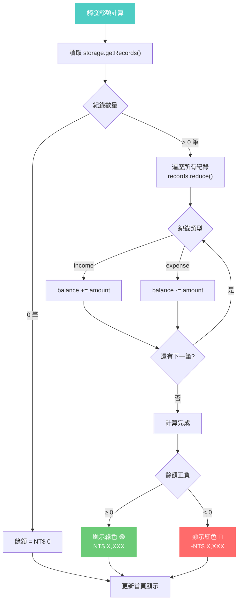

---

### 3.2 月度摘要計算

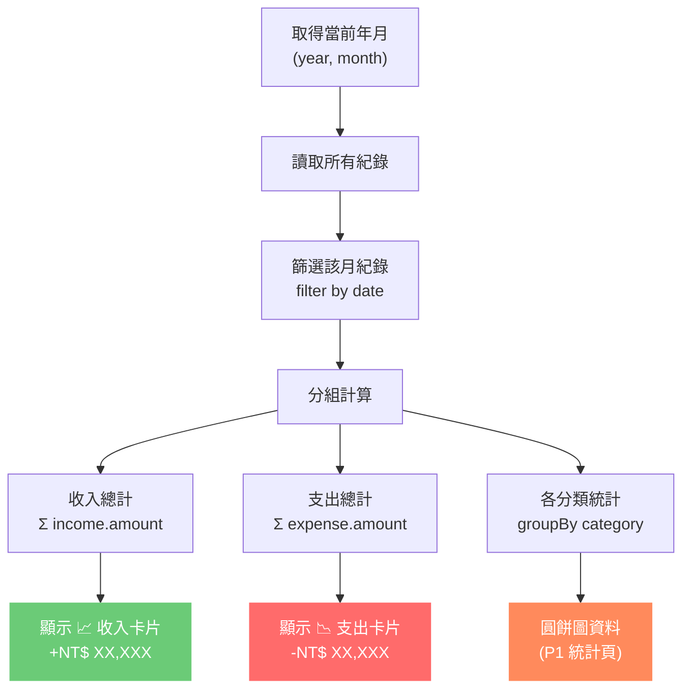

---

### 3.3 資料存取層流程

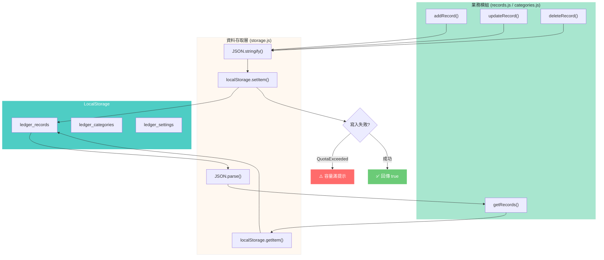

---

## 4. 統計圖表流程（P1）

### 4.1 圓餅圖生成

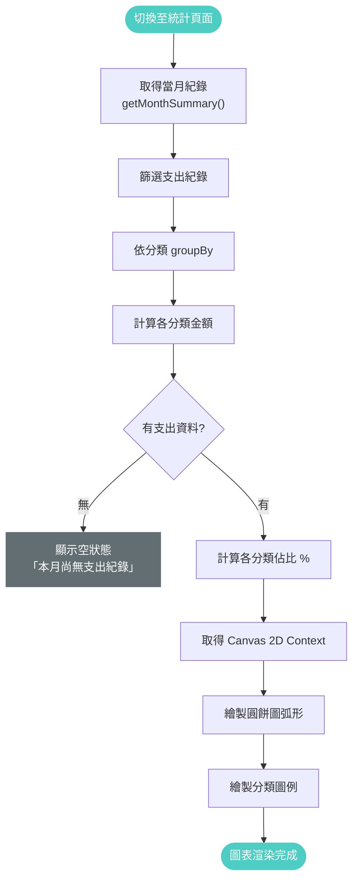

---

### 4.2 長條圖生成

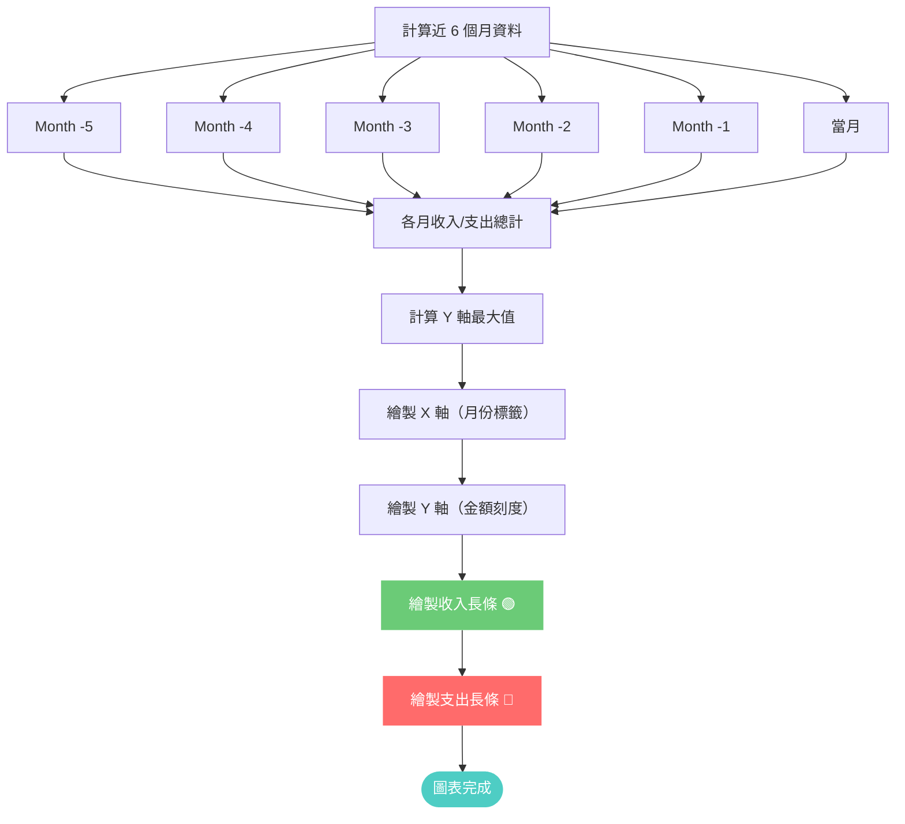

---

## 5. 匯出功能流程（P2）

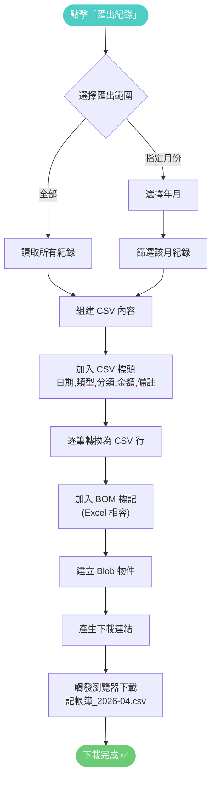

---

## 6. 錯誤處理流程

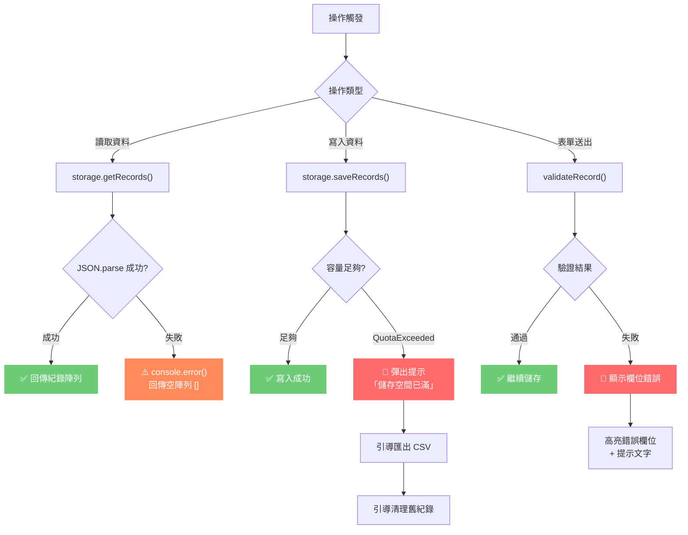

---

## 7. 完整用戶旅程

### 7.1 首次使用旅程

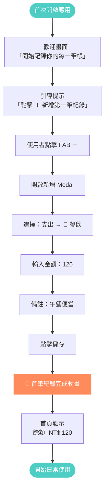

---

### 7.2 日常使用旅程

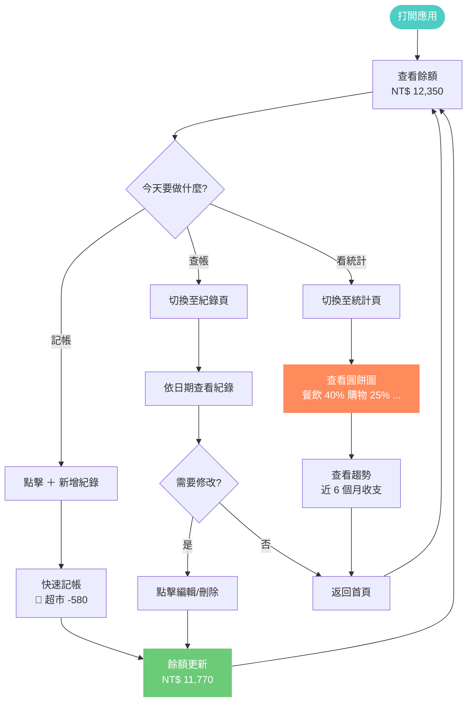

---

### 7.3 月底結算旅程

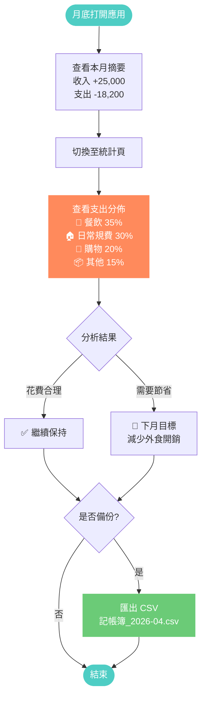

---

## 圖表索引

| 編號 | 圖表名稱 | 類型 | 對應功能 |
|------|----------|------|----------|
| 1.1 | 應用啟動流程 | Flowchart | 系統初始化 |
| 1.2 | 頁面導航流程 | Flowchart | SPA 路由 |
| 2.1 | 新增收支紀錄 | Flowchart | F2 |
| 2.2 | 編輯紀錄 | Flowchart | F5 |
| 2.3 | 刪除紀錄 | Flowchart | F5 |
| 2.4 | 查看歷史紀錄 | Flowchart | F4 |
| 3.1 | 餘額計算流程 | Flowchart | F1 |
| 3.2 | 月度摘要計算 | Flowchart | F1 |
| 3.3 | 資料存取層流程 | Flowchart | 架構 |
| 4.1 | 圓餅圖生成 | Flowchart | F6 |
| 4.2 | 長條圖生成 | Flowchart | F6 |
| 5 | 匯出功能流程 | Flowchart | F7 |
| 6 | 錯誤處理流程 | Flowchart | 非功能需求 |
| 7.1 | 首次使用旅程 | Flowchart | 用戶旅程 |
| 7.2 | 日常使用旅程 | Flowchart | 用戶旅程 |
| 7.3 | 月底結算旅程 | Flowchart | 用戶旅程 |
