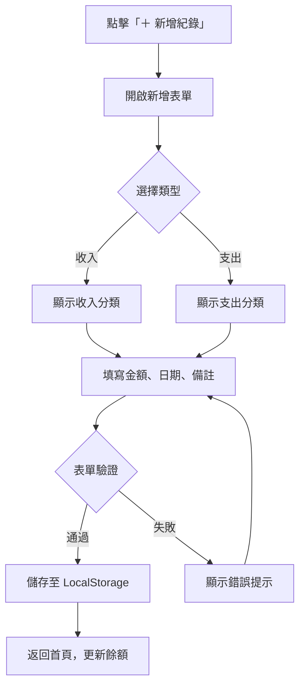
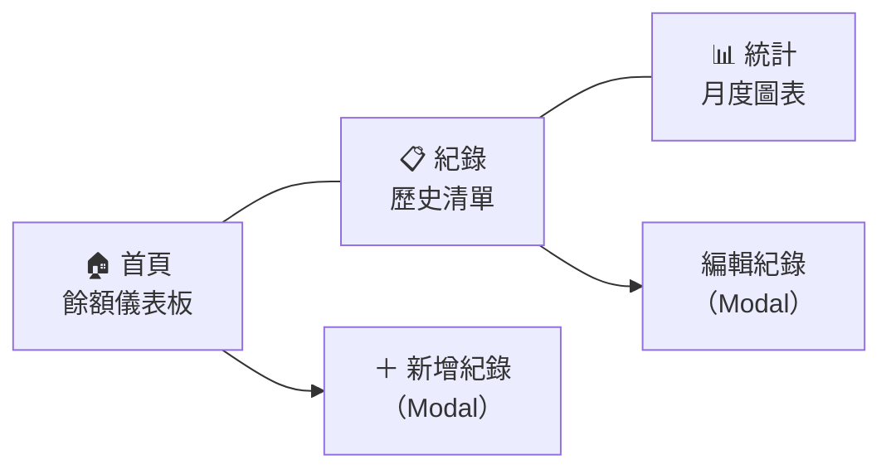
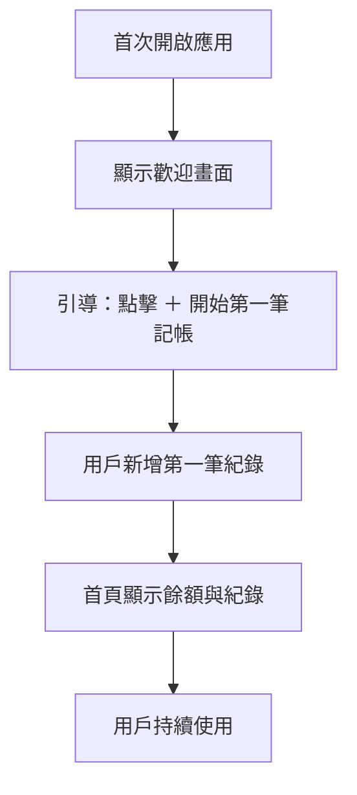
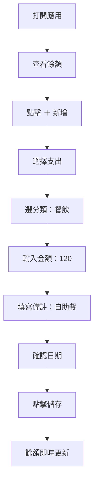

# 個人記帳簿系統 — 產品需求文件（PRD）

## 1. 產品概覽

| 項目 | 說明 |
|------|------|
| **產品名稱** | 個人記帳簿 |
| **產品類型** | 靜態網頁應用（HTML + CSS + JavaScript） |
| **目標用戶** | 家庭主婦 |
| **核心價值** | 簡單直覺的介面，輕鬆記錄日常收支，即時掌握家庭財務狀況 |
| **資料儲存** | 瀏覽器 LocalStorage（免後端、免註冊） |

---

## 2. 目標用戶分析

### 2.1 用戶畫像

| 特徵 | 描述 |
|------|------|
| **角色** | 家庭主婦，負責管理家庭日常開銷 |
| **年齡** | 25–55 歲 |
| **技術程度** | 基礎手機 / 電腦操作，不熟悉複雜軟體 |
| **使用場景** | 買菜回家後記帳、繳費後記錄、月底檢視花費 |
| **核心需求** | 快速記帳、一目了然的餘額、回顧消費紀錄 |

### 2.2 用戶痛點

- 手寫記帳容易遺忘或計算錯誤
- 現有記帳 App 功能過多、介面複雜
- 需要簡單明暸的分類，快速了解錢花在哪裡
- 需要隨時修正記錯的帳目

---

## 3. 功能需求

### 3.1 功能清單總覽

| 編號 | 功能 | 優先級 | 說明 |
|------|------|--------|------|
| F1 | 首頁餘額儀表板 | P0 | 顯示當前帳戶餘額、本月收入 / 支出摘要 |
| F2 | 新增收支紀錄 | P0 | 記錄金額、類型（收入/支出）、分類、備註、日期 |
| F3 | 消費分類管理 | P0 | 預設分類 + 自訂分類 |
| F4 | 歷史紀錄清單 | P0 | 按日期排序、篩選、搜尋歷史紀錄 |
| F5 | 編輯 / 刪除紀錄 | P0 | 修正錯誤資料或刪除不需要的紀錄 |
| F6 | 月度統計圖表 | P1 | 圓餅圖顯示各分類佔比 |
| F7 | 匯出紀錄 | P2 | 匯出為 CSV 檔案備份 |

---

### 3.2 功能詳細規格

#### F1：首頁餘額儀表板

> [!IMPORTANT]
> 這是用戶打開應用時的第一個畫面，必須簡潔有力、資訊清晰。

| 項目 | 說明 |
|------|------|
| **當前餘額** | 大字醒目顯示，正數為綠色、負數為紅色 |
| **本月收入** | 顯示本月累計收入金額 |
| **本月支出** | 顯示本月累計支出金額 |
| **最近紀錄** | 顯示最近 5 筆交易紀錄的快速預覽 |
| **快捷按鈕** | 「＋ 新增紀錄」浮動按鈕，隨時可快速記帳 |

**介面佈局草稿：**

```
┌─────────────────────────────┐
│       💰 個人記帳簿          │
├─────────────────────────────┤
│                             │
│     當前餘額                │
│     NT$ 12,350              │
│                             │
│  ┌──────────┬──────────┐    │
│  │ 📈 收入   │ 📉 支出   │    │
│  │ +25,000  │ -12,650  │    │
│  └──────────┴──────────┘    │
│                             │
│  ── 最近紀錄 ──             │
│  04/10  🍜 午餐    -120     │
│  04/10  🛒 超市    -580     │
│  04/09  💰 薪資  +25,000    │
│  04/09  🏠 房租   -8,000    │
│  04/08  ☕ 飲料     -65     │
│                             │
│              [＋ 新增紀錄]   │
└─────────────────────────────┘
│  🏠首頁  │  📋紀錄  │  📊統計  │
└─────────────────────────────┘
```

---

#### F2：新增收支紀錄

| 欄位 | 類型 | 必填 | 說明 |
|------|------|------|------|
| **類型** | 切換按鈕 | ✅ | 收入 / 支出（預設為支出） |
| **金額** | 數字輸入 | ✅ | 正整數，支援千分位顯示 |
| **分類** | 下拉選單 | ✅ | 根據類型切換對應分類選項 |
| **日期** | 日期選擇器 | ✅ | 預設為今天 |
| **備註** | 文字輸入 | ❌ | 選填，最多 50 字 |

**交互流程：**



---

#### F3：消費分類管理

**預設分類：**

| 類型 | 分類 | 圖示 |
|------|------|------|
| 支出 | 🍜 餐飲 | 早餐、午餐、晚餐、飲料、外食 |
| 支出 | 🛒 購物 | 超市、日用品、衣物 |
| 支出 | 🏠 日常規費 | 房租、水電、瓦斯、網路 |
| 支出 | 🚗 交通 | 加油、停車、公車捷運 |
| 支出 | 🏥 醫療 | 看診、藥品 |
| 支出 | 🎓 教育 | 學費、補習、書籍 |
| 支出 | 🎉 娛樂 | 電影、旅遊、聚餐 |
| 支出 | 📦 其他 | 無法歸類的支出 |
| 收入 | 💰 薪資 | 固定薪水 |
| 收入 | 🎁 獎金 | 年終、績效獎金 |
| 收入 | 💵 兼職 | 副業收入 |
| 收入 | 📈 投資 | 利息、股息 |
| 收入 | 📦 其他 | 無法歸類的收入 |

> [!TIP]
> 使用 Emoji 作為分類圖示，無需額外圖片資源，視覺效果直覺友善。

---

#### F4：歷史紀錄清單

| 功能 | 說明 |
|------|------|
| **排序** | 依日期降序排列（最新在上） |
| **篩選** | 可按月份、分類、類型（收入/支出）篩選 |
| **搜尋** | 依備註關鍵字搜尋 |
| **分組** | 按日期分組顯示，每日小計 |
| **無限滾動** | 紀錄超過一頁時可向下滾動載入更多 |

**列表項目格式：**

```
┌─────────────────────────────┐
│ 2026 年 4 月 10 日（五）      │
│ ─────────────────────────── │
│ 🍜 午餐         -NT$ 120    │
│    備註：自助餐              │
│ 🛒 超市採買      -NT$ 580    │
│    備註：買菜、衛生紙         │
│           ── 日計 -NT$ 700 ──│
├─────────────────────────────┤
│ 2026 年 4 月 9 日（四）       │
│ ─────────────────────────── │
│ 💰 薪資        +NT$ 25,000  │
│ 🏠 房租         -NT$ 8,000  │
│        ── 日計 +NT$ 17,000 ──│
└─────────────────────────────┘
```

---

#### F5：編輯 / 刪除紀錄

| 操作 | 觸發方式 | 說明 |
|------|----------|------|
| **編輯** | 點擊紀錄項目 | 開啟編輯表單，預填原有資料 |
| **刪除** | 左滑或長按 → 刪除按鈕 | 彈出確認對話框後刪除 |

> [!WARNING]
> 刪除操作不可復原，必須顯示確認對話框：「確定要刪除這筆紀錄嗎？此操作無法復原。」

---

#### F6：月度統計圖表（P1）

| 項目 | 說明 |
|------|------|
| **圓餅圖** | 顯示當月各支出分類佔比 |
| **長條圖** | 顯示近 6 個月收支趨勢 |
| **月份切換** | 左右箭頭切換檢視月份 |
| **技術方案** | 使用純 CSS 或 Canvas 繪製，免外部套件 |

---

#### F7：匯出功能（P2）

| 項目 | 說明 |
|------|------|
| **格式** | CSV 檔案 |
| **欄位** | 日期、類型、分類、金額、備註 |
| **範圍** | 可選擇匯出全部或指定月份 |

---

## 4. 非功能需求

### 4.1 效能

| 項目 | 要求 |
|------|------|
| 首頁載入 | < 1 秒 |
| 新增紀錄儲存 | < 0.5 秒 |
| 紀錄搜尋 | < 0.5 秒 |
| 支援紀錄筆數 | ≥ 5,000 筆 |

### 4.2 相容性

| 項目 | 要求 |
|------|------|
| 桌面瀏覽器 | Chrome、Edge、Firefox 最新兩版 |
| 行動裝置 | iOS Safari、Android Chrome |
| 響應式設計 | 完整支援 320px ~ 1440px 寬度 |

### 4.3 無障礙

- 字體大小最小 16px，方便閱讀
- 按鈕與點擊區域最小 44×44px
- 色彩對比度符合 WCAG AA 標準
- 支援鍵盤導航

### 4.4 資料安全

- 資料僅儲存於使用者瀏覽器 LocalStorage
- 不傳送任何資料至外部伺服器
- 提示使用者定期匯出備份

---

## 5. 技術架構

### 5.1 技術選型

| 層級 | 技術 |
|------|------|
| **結構** | HTML5 語義化標籤 |
| **樣式** | 原生 CSS（CSS Variables 設計系統） |
| **邏輯** | 原生 JavaScript（ES6+） |
| **資料** | LocalStorage（JSON 格式） |
| **圖表** | Canvas API 或純 CSS |
| **部署** | 靜態檔案，可直接開啟或部署至任何靜態主機 |

### 5.2 資料結構

```javascript
// LocalStorage 中的資料格式
{
  "records": [
    {
      "id": "uuid-v4",           // 唯一識別碼
      "type": "expense",         // "income" | "expense"
      "amount": 120,             // 金額（正整數）
      "category": "餐飲",        // 分類名稱
      "categoryIcon": "🍜",     // 分類圖示
      "note": "自助餐",          // 備註
      "date": "2026-04-10",     // 日期 (ISO 格式)
      "createdAt": 1712700000   // 建立時間戳
    }
  ],
  "categories": {
    "expense": ["餐飲", "購物", "日常規費", "交通", "醫療", "教育", "娛樂", "其他"],
    "income": ["薪資", "獎金", "兼職", "投資", "其他"]
  }
}
```

### 5.3 檔案結構

```
melody6968806-hue/
├── index.html          # 主頁面（SPA 單頁應用）
├── css/
│   └── style.css       # 完整樣式表
├── js/
│   ├── app.js          # 主程式入口、路由管理
│   ├── storage.js      # LocalStorage 資料存取層
│   ├── records.js      # 收支紀錄 CRUD 邏輯
│   ├── categories.js   # 分類管理邏輯
│   ├── charts.js       # 統計圖表繪製
│   └── utils.js        # 工具函式（格式化、驗證等）
└── README.md           # 專案說明
```

---

## 6. 介面設計規範

### 6.1 設計風格

| 項目 | 說明 |
|------|------|
| **主色調** | 溫暖柔和色系（薄荷綠 + 奶油白 + 珊瑚粉） |
| **風格** | 圓角卡片式設計、微漸層、柔和陰影 |
| **字體** | Google Fonts — "Noto Sans TC"（繁體中文友善） |
| **動畫** | 頁面切換淡入淡出、按鈕微互動、數字滾動效果 |
| **圖示** | Emoji 為主，簡潔直覺 |

### 6.2 色彩系統

```css
:root {
  /* 主色 */
  --primary:       #4ECDC4;  /* 薄荷綠 */
  --primary-dark:  #3AB5AD;
  --primary-light: #A8E6CF;

  /* 語意色 */
  --income:        #6BCB77;  /* 收入綠 */
  --expense:       #FF6B6B;  /* 支出紅 */
  --balance:       #4ECDC4;  /* 餘額色 */

  /* 中性色 */
  --bg:            #FFF8F0;  /* 奶油白背景 */
  --card:          #FFFFFF;
  --text-primary:  #2D3436;
  --text-secondary:#636E72;
  --border:        #E8E8E8;

  /* 強調色 */
  --accent:        #FF8A5C;  /* 珊瑚橘 */
}
```

### 6.3 頁面導航



底部導航列（Tab Bar）包含三個主頁面，新增 / 編輯以 Modal 彈窗呈現。

---

## 7. 用戶旅程

### 7.1 首次使用



### 7.2 日常記帳流程



---

## 8. 驗收標準

### 8.1 功能驗收

| 編號 | 驗收項目 | 通過條件 |
|------|----------|----------|
| AC1 | 新增支出紀錄 | 填入金額、分類、日期後成功儲存，餘額減少 |
| AC2 | 新增收入紀錄 | 填入金額、分類、日期後成功儲存，餘額增加 |
| AC3 | 餘額計算 | 餘額 = 所有收入總和 − 所有支出總和，精確無誤 |
| AC4 | 編輯紀錄 | 修改後資料正確更新，餘額同步更新 |
| AC5 | 刪除紀錄 | 確認後刪除成功，餘額同步更新 |
| AC6 | 分類篩選 | 選擇特定分類後，僅顯示該分類紀錄 |
| AC7 | 月份篩選 | 切換月份後，僅顯示該月紀錄 |
| AC8 | 資料持久化 | 關閉瀏覽器重開後，資料完整保留 |
| AC9 | 空金額防呆 | 金額為 0 或未填時，無法送出並顯示提示 |
| AC10 | 響應式佈局 | 手機與桌面均正常使用 |

### 8.2 效能驗收

| 項目 | 標準 |
|------|------|
| Lighthouse 效能分數 | ≥ 90 |
| 首次渲染 (FCP) | < 1.0s |
| 互動回應時間 | < 100ms |

---

## 9. 開發排程建議

| 階段 | 內容 | 預估時間 |
|------|------|----------|
| Phase 1 | HTML 結構 + CSS 設計系統 + 基礎佈局 | 1 小時 |
| Phase 2 | LocalStorage 資料層 + 新增紀錄功能 | 1 小時 |
| Phase 3 | 首頁儀表板 + 餘額計算 | 0.5 小時 |
| Phase 4 | 歷史紀錄清單 + 篩選搜尋 | 1 小時 |
| Phase 5 | 編輯 / 刪除紀錄 | 0.5 小時 |
| Phase 6 | 統計圖表（P1） | 1 小時 |
| Phase 7 | 匯出功能（P2）+ 整體打磨 | 0.5 小時 |
| **合計** | | **~5.5 小時** |

---

## 10. 風險與緩解

| 風險 | 影響 | 緩解措施 |
|------|------|----------|
| LocalStorage 容量限制（~5MB） | 紀錄超多時可能滿 | 提供匯出功能 + 容量預警 |
| 使用者清除瀏覽器資料 | 所有紀錄遺失 | 提醒定期匯出備份 |
| 行動裝置輸入體驗 | 金額輸入不便 | 使用 `type="number"` + 大按鈕 |
| 不同瀏覽器相容性 | 樣式或功能差異 | 使用標準 API，避免實驗性特性 |

---

## Open Questions

> [!IMPORTANT]
> 以下問題可能影響實作方向，請確認：

1. **幣別顯示**：是否固定使用 NT$（新台幣），還是需要支援多幣別？
2. **預算功能**：是否需要設定每月預算上限並在超支時提醒？
3. **多帳戶**：是否需要分帳戶管理（如：現金、銀行、信用卡）？
4. **深色模式**：是否需要支援深色模式切換？

---

## Verification Plan

### Automated Tests
- 瀏覽器中開啟 `index.html`，驗證所有 P0 功能正常運作
- 測試新增、編輯、刪除紀錄的完整流程
- 驗證餘額計算正確性
- 測試響應式佈局（桌面 + 手機視窗）

### Manual Verification
- 在 Chrome / Edge / Firefox 中分別測試
- 在手機瀏覽器中測試觸控操作
- 清除 LocalStorage 後重新開啟，確認空狀態處理正確
